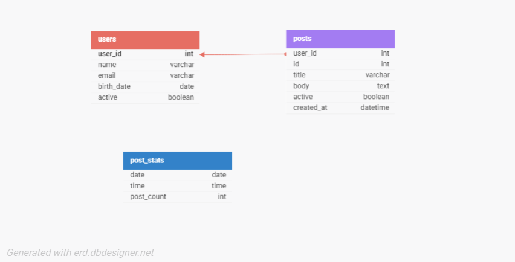
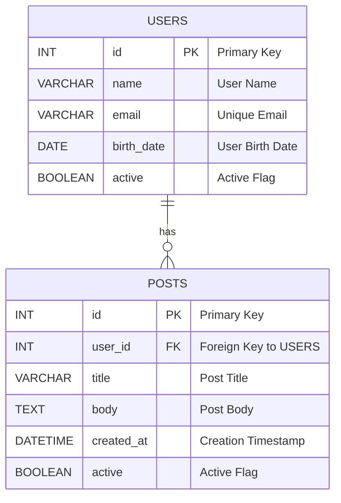

# PHP SQL Challenge

This project demonstrates a PHP/MySQL backend application designed for a junior backend position. It covers key areas such as:

- **Database Setup & Seeding:** Automated creation of a database and tables (users and posts) with a `birth_date` column in users, seeding the tables by fetching data from an external API via cURL.
- **Advanced Queries:**  
  - Retrieving the latest post for each user with a birthday in the current month.
  - Grouping posts by date and hour with a count of posts.
- **User Interface:** Two pages:
  - `index.php` displays users along with their avatar and posts.
  - `advanced_ui.php` shows advanced query results using a clean UI styled with external CSS (`style.css` and `advanced.css` or inline as needed).

## Project Structure

- **init.php:**  
  Sets up the MySQL database, creates tables, inserts users and posts, and downloads an avatar image.
  
- **index.php:**  
  Displays active users with their avatars and associated posts.
  
- **advanced_ui.php:**  
  Displays advanced query results:
  - Latest posts for users with birthdays this month.
  - Posts grouped by date and hour.
  
- **db/Database.php:**  
  Contains the `Database` class for managing the PDO connection and executing queries, including a custom `rawQuery` method for advanced queries.
  
- **style.css:**  
  Contains global CSS styling for the project.
  
- **advanced.css (optional):**  
  Contains additional styling for the advanced UI (this can be merged or replaced with inline styles if preferred).

- **README.md:**  
  This documentation file.

## Setup Instructions

1. **Clone the Repository:**
   ```bash
   git clone https://github.com/sharonshimon/php-sql-challenge.git
   cd php-sql-challenge
   ```

2. **Configure Your Environment:**
   - Update `config.php` with your MySQL database credentials and API constants.
   - Ensure cURL is enabled in your PHP configuration.

3. **Run the Initialization Script:**
   - Open `init.php` in your browser (e.g., [http://localhost/php-sql-challenge/init.php](http://localhost/php-sql-challenge/init.php)) to create the database, tables, seed data, and download the avatar.

4. **View the Application:**
   - Visit `index.php` to see the list of users with avatars and their posts.
   - Visit `advanced_ui.php` to view the advanced queries interface with the latest birthday posts and posts grouped by date and hour.

## Requirements

- PHP 7 or higher
- MySQL
- cURL enabled in PHP

## Future Enhancements

- **Unit Testing:** Consider adding PHPUnit tests to verify key functions (e.g., API fetching, database operations).
- **Error Handling:** Improve error handling by implementing proper logging instead of using `die()`.
- **UI Enhancements:** Extend the UI with additional interactivity, such as filtering, pagination, or inline editing.
- **Security Improvements:** Implement input validation and sanitization if moving toward live data input.

## Author

Sharon Shimon

## License

This project is licensed under the MIT License.

## Database ER Diagram

Below is the ER diagram that represents the structure of the project's database:



